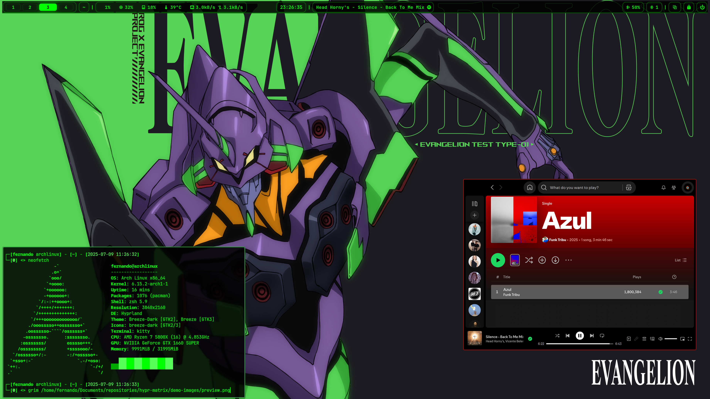
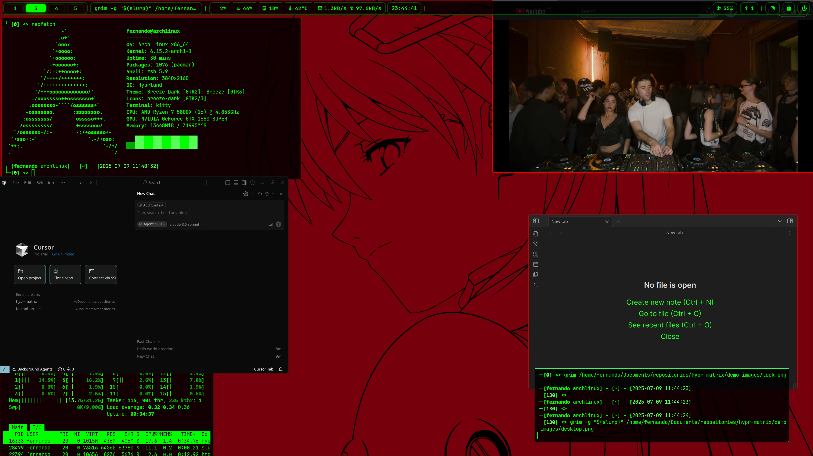

# 🟢 Hypr Matrix Theme

A complete Matrix-themed configuration for Hyprland, featuring a sleek neon green aesthetic and modern functionality.



## 🎯 Overview

This project provides a comprehensive Matrix-themed configuration for Hyprland, transforming your Linux desktop into a cyberpunk environment inspired by The Matrix movie. It includes custom configurations for:

- 🪟 **Hyprland** - A dynamic tiling Wayland compositor
- 🖥️ **Kitty** - A fast, feature-rich terminal emulator
- 📊 **Waybar** - A highly customizable status bar
- 🚀 **Wofi** - A modern application launcher
- 🔒 **Hyprlock** - A secure and stylish screen locker

## ✨ Features

### 🎨 Visual Elements
- Neon green color scheme throughout the system
- Matrix-style animations and effects
- Custom-designed icons and UI elements
- Translucent windows with blur effects
- Smooth animations and transitions

### ⚡ Functionality
- Dynamic workspace management
- Efficient window tiling
- Quick application launching
- System monitoring widgets
- Media controls
- Network and Bluetooth management
- Battery status (for laptops)
- Volume and brightness controls
- Secure screen locking

## 🛠️ Prerequisites

Before installing, ensure you have:
- Arch Linux or an Arch-based distribution
- Git installed (`sudo pacman -S git`)
- Basic terminal knowledge
- Internet connection for downloading packages

## 📦 Installation

1. **Clone the Repository**
```bash
git clone https://github.com/luissfer/hypr-matrix.git
cd hypr-matrix
```

2. **Install Dependencies**
```bash
# Make the installation script executable
chmod +x pacman_install.sh

# Run the installation script
./pacman_install.sh
```

3. **Apply Configuration**
```bash
# Make the configuration script executable
chmod +x apply_changes.sh

# Apply the configuration
./apply_changes.sh
```

## 🔧 Configuration

### Hyprland Configuration
Location: `~/.config/hypr/`
- `hyprland.conf` - Main configuration file
- `hyprpaper.conf` - Wallpaper settings
- `hyprlock.conf` - Lock screen configuration

### Kitty Terminal
Location: `~/.config/kitty/`
- Custom color scheme
- Matrix-themed styling
- Performance optimizations

### Waybar
Location: `~/.config/waybar/`
- System monitoring
- Network status
- Media controls
- Custom modules

### Wofi
Location: `~/.config/wofi/`
- Application launcher
- Power menu
- Network manager
- Bluetooth controller

## ⌨️ Keyboard Shortcuts

### Window Management
- `Super + Q` - Open terminal
- `Super + C` - Close active window
- `Super + V` - Toggle floating mode
- `Super + R` - Open application launcher
- `Super + L` - Lock screen
- `Super + [1-0]` - Switch to workspace 1-10
- `Super + Shift + [1-0]` - Move window to workspace 1-0

### System Controls
- `Volume Keys` - Control system volume
- `Brightness Keys` - Control screen brightness
- `Media Keys` - Control media playback

## 🔄 Updates and Maintenance

To update the configuration:
1. Pull the latest changes:
```bash
git pull origin main
```

2. Reapply the configuration:
```bash
./apply_changes.sh
```

## 🖼️ Screenshots

### Desktop Overview


### Application Launcher


### Lock Screen


## 🚀 Why Cursor IDE?

[Cursor](https://cursor.sh) is a modern, AI-powered IDE that enhances your development experience:

### Key Benefits
- 🤖 **AI Code Completion**: Smart suggestions and auto-completion
- 🔍 **Intelligent Code Navigation**: Quick file and symbol lookup
- 🛠️ **Built-in AI Assistant**: Help with coding questions and debugging
- ⚡ **Performance**: Fast and responsive editing experience
- 🎨 **Modern Interface**: Clean and customizable UI
- 🔄 **Git Integration**: Seamless version control
- 📦 **Extension Support**: VSCode extension compatibility

### Why Choose Cursor?
1. **Productivity Boost**: AI features help write and understand code faster
2. **Smart Context Understanding**: Better code suggestions based on your project
3. **Modern Development**: Built for today's development needs
4. **Community Support**: Active development and updates
5. **Free to Use**: Powerful features available at no cost

## 🤝 Contributing

Contributions are welcome! Please feel free to submit a Pull Request. For major changes, please open an issue first to discuss what you would like to change.

## 📄 License

This project is licensed under the MIT License - see the [LICENSE](LICENSE) file for details.

## 🙏 Acknowledgments

- The Matrix movies for inspiration
- Hyprland development team
- Waybar contributors
- Wofi developers
- Kitty terminal team
- All open-source contributors

## 📞 Support

If you encounter any issues or have questions:
1. Check the [issues](https://github.com/luissfer/hypr-matrix/issues) page
2. Create a new issue with detailed information
3. Join our community discussions

---
Made with 💚 by [luissfer] 
